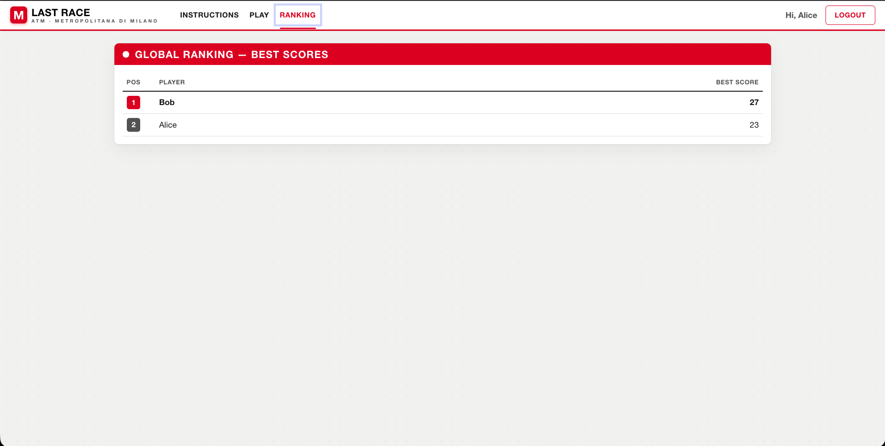
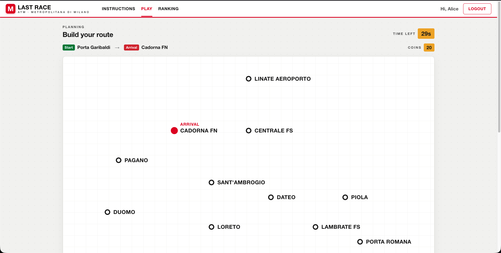
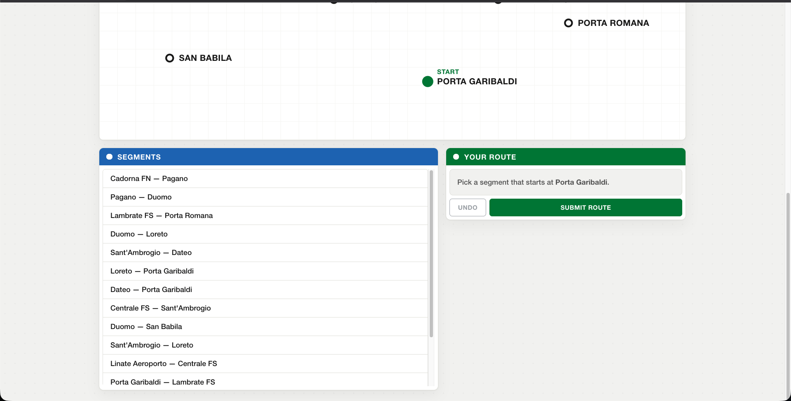

# Exam #1: "Last Race"
## Student: s354774 CALVELLO GIUSEPPE ANTONIO

> Single-player metro-routing game inspired by *Race the Rails*, themed on the Milano underground (ATM).
> Two-server SPA: React 19 client (`client/`, Vite dev server) + Node/Express API (`server/`) with a SQLite database.
> Run with: `cd server; nodemon index.js` and `cd client; npm run dev`.

## React Client Application Routes

- Route `/`: instructions page. Anonymous visitors see only the rules (no map); logged-in users also get the line legend and a "Start playing" button.
- Route `/login`: login form (username + password) for session authentication.
- Route `/play`: the game itself (protected). Drives the four phases Setup → Planning → Execution → Result.
- Route `/ranking`: global ranking (protected), best score per player.
- Route `*`: any unknown path redirects to `/`.

## API Server

- POST `/api/sessions`
  - request body: `{ username, password }`
  - response: `{ id, username, name }` on success, `401` (**Unauthorized**) on wrong credentials, `422` (**Unprocessable Content**) on invalid input.
- GET `/api/sessions/current`
  - request: session cookie
  - response: the authenticated user `{ id, username, name }`, or `401` (**Unauthorized**)  if not logged in.
- DELETE `/api/sessions/current`
  - request: session cookie; logs the user out
  - response: empty body.
- GET `/api/network` (auth)
  - request: session cookie
  - response: full network for the Setup phase - `{ stations:[{id,name,x,y}], lines:[{id,name,color,stations:[stationId,…]}], segments:[{from,to}] }`.
- POST `/api/games` (auth)
  - request: session cookie (no body); the server assigns start/destination (BFS distance ≥ 3)
  - response: planning payload **without line information** - `{ gameId, coins:20, start:{id,name}, dest:{id,name}, stations:[{id,name,x,y}], segments:[{from,to}] }` (segments shuffled).
- POST `/api/games/:id/route` (auth)
  - request params: `id` (game id); body: `{ route:[stationId,…] }`
  - response: validated outcome. Valid & in time → `{ valid:true, expired, finalScore, steps:[{from:{id,name}, to:{id,name}, event:{description,effect}, coinsAfter}] }`. Invalid / incomplete / late → `{ valid:false, expired, steps:[], finalScore:0 }`. `403` if the game is not the caller's, `404` if not pending, `422` on malformed input.
- GET `/api/ranking` (auth)
  - request: session cookie
  - response: `[{ name, bestScore }]`, ordered by best score (only completed games count).

## Database Tables

- Table `users` - registered users: `username`, display `name`, and the password stored as scrypt `hash` + per-user `salt`.
- Table `stations` - the stations: unique `name` and `x`,`y` coordinates used to draw the schematic map.
- Table `lines` - the metro lines: unique `name` and a display `color`.
- Table `line_stations` - ordered membership: which stations belong to each line and in which `position`; consecutive positions define the connections (segments) and which station is an interchange.
- Table `events` - the random events: a `description`, an integer `effect` (−4…+4, enforced by a CHECK), and a `weight` for the probability of being drawn.
- Table `games` - one row per game: owner `user_id`, assigned `start_station_id`/`dest_station_id`, final `score`, `status` (`pending`/`completed`/`invalid`) and `created_at` (used to enforce the 90 s limit server-side).
- Table `game_segments` - per-step result of a completed game: ordinal `ord`, the `from`/`to` stations, the drawn `event_id` and the running `coins_after`.

## Main React Components

- `App` / `RequireAuth` (in `App.jsx`): declares the routes; `RequireAuth` guards protected routes, redirecting anonymous users to `/login`.
- `AuthProvider` + `useAuth` (in `contexts/AuthContext.jsx` + `contexts/auth-context.js`): hold the logged-in user in context and expose `login`/`logout`; the session is checked once on load.
- `NavBar` (in `components/NavBar.jsx`): top navigation, adapts links and login/logout to the auth state.
- `Instructions` (in `pages/Instructions.jsx`): the rules; hides the map from anonymous visitors.
- `LoginForm` (in `pages/LoginForm.jsx`): the authentication form.
- `PlayPage` (in `pages/PlayPage.jsx`): orchestrates the game, holding the current phase and game/result state.
- `SetupView` (in `components/SetupView.jsx`): fetches and shows the full network (stations + lines) before playing.
- `PlanningView` (in `components/PlanningView.jsx`): the 90 s planning screen - stations-only map, start/destination, segment list and the route being built.
- `NetworkMap` (in `components/NetworkMap.jsx`): SVG schematic map; draws lines in Setup and stations-only in Planning.
- `SegmentList` (in `components/SegmentList.jsx`): scrollable list of connectable pairs; already-used segments are disabled (each segment once).
- `RouteBuilder` (in `components/RouteBuilder.jsx`): shows the reconstructed route with undo/submit.
- `CountdownTimer` (in `components/CountdownTimer.jsx`): the 90 s countdown, auto-submitting on expiry.
- `ExecutionView` (in `components/ExecutionView.jsx`): replays the journey one step at a time, revealing each event and the running coin total.
- `ResultView` (in `components/ResultView.jsx`): the final score and "play again".
- `Ranking` (in `pages/Ranking.jsx`): the leaderboard table.

(only _main_ components, minor ones may be skipped)

## Screenshots

Ranking page:

During a game (Planning phase):

## Users Credentials

| username | password  | notes |
|----------|-----------|-------|
| alice    | password1 | has already played several games |
| bob      | password2 | has already played a game |
| carol    | password3 | has not played yet |

## Use of AI Tools

I've used Claude to implement the NetworkMap's logic for the map rendering, to design a dynamic map retrieving the info for the rendering of the map
from the information retrieved from the database.
Claude has also been used to check if all the exam specification had been satisfied or not and find any possible flaw in the code and for the theme.css file.
